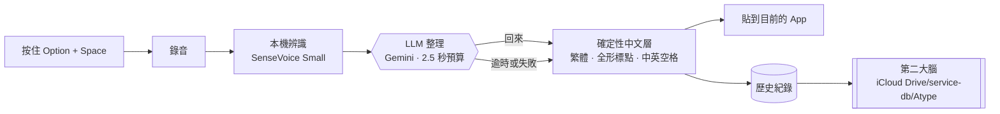

# Atype

按住熱鍵說話，放開就得到可以直接送出的**繁體中文**：去掉贅詞、保留中英夾雜、全形標點、中英之間有空格，不出簡體，不改你的意思。

這是自用的 Typeless。Mac 已經能用；iPhone 是下一步，做成和 Typeless 一樣的鍵盤。架構圖解在 [`docs/architecture.html`](docs/architecture.html)。


## 在 Mac 上安裝

只支援 Apple 晶片（M1 以後）的 Mac。LLM 整理請自備 Gemini API key。

- **下載編好的 App**：到 [Releases](https://github.com/JohnKeng/Atype/releases/latest) 下載 zip，把 `Atype.app` 拖進「應用程式」。App 沒有經過 Apple 公證，第一次打開會被擋，要到「系統設定 → 隱私權與安全性」按「仍要打開」。
- **自己編**：需要 Xcode Command Line Tools、Rust、bun、cmake，第一次約 5 到 10 分鐘。

```bash
git clone https://github.com/JohnKeng/Atype.git
cd Atype/apps/mac
bun install
bun run app:install      # 編譯並安裝到「應用程式」
```

兩種方式的詳細步驟、被擋時怎麼打開、第一次設定（下載模型、填 Gemini key、給權限）與每天的用法，都在 [`apps/mac/README.md`](apps/mac/README.md)。

## iPhone

Atype 鍵盤使用公開 iOS API：先手動開啟 Atype，完成一次錄音進入待命，再切回原本的 App。待命中可由鍵盤控制錄音，說完文字插在游標處。待命結束後須重新開啟 Atype。✦ AI 指令、提示詞、詞典、我的資料透過 iCloud 和 Mac 共用；辨識使用 iPhone 內建的本機模型。

**自行建置**需要 Xcode 26+、[XcodeGen](https://github.com/yonaskolb/XcodeGen) 與支援 App Groups 的 Apple Developer 團隊：

```bash
cd Atype/apps/ios
xcodegen generate
open Atype.xcodeproj
```

把 Atype 與 AtypeKeyboard 兩個 target 的 Team 換成你的帳號，接上 iPhone 執行；再到「設定 → 一般 → 鍵盤 → 鍵盤 → 新增鍵盤」加入 Atype 並打開「允許完全取用」。

## TestFlight 建置與上傳

發布團隊為 YENTING WU。iOS 使用 `com.yentingwu.atype.ios`，Mac 使用 `com.yentingwu.atype.mac`；下一次上傳前增加 iOS `project.yml` 與 Mac `tauri.appstore.conf.json`、`distribution/project.yml` 中的 build number。App Store Connect 必須先有對應的 App 紀錄。

Mac TestFlight 版為沙盒版：從選單控制錄音，結果複製到剪貼簿供手動貼上；不使用全域鍵盤輸入與透明私有 API 浮窗。一般下載版保留 `macos-overlay` 預設 feature。沙盒版的預設第二大腦存放在 App 自己的容器中；外部資料夾需由使用者授權，不能直接套用一般版的任意磁碟路徑。

從儲存庫根目錄執行，簽署與上傳沿用 Xcode 已登入的帳號：

```bash
export DEVELOPER_DIR=/Applications/Xcode.app/Contents/Developer
xcodegen generate --spec apps/ios/project.yml
xcodebuild -project apps/ios/Atype.xcodeproj -scheme Atype -configuration Release \
  -destination 'generic/platform=iOS' -archivePath build/releases/Atype-iOS.xcarchive \
  -allowProvisioningUpdates archive
xcodebuild -exportArchive -archivePath build/releases/Atype-iOS.xcarchive \
  -exportOptionsPlist apps/ios/ExportOptions.plist -exportPath build/releases/ios \
  -allowProvisioningUpdates

(cd apps/mac && MACOSX_DEPLOYMENT_TARGET=14.0 bun run app:store:build)
xcodegen generate --spec apps/mac/distribution/project.yml
xcodebuild -project apps/mac/distribution/AtypeDistribution.xcodeproj -scheme Atype \
  -configuration Release -destination 'generic/platform=macOS' \
  -archivePath build/releases/Atype-macOS.xcarchive -allowProvisioningUpdates archive
xcodebuild -exportArchive -archivePath build/releases/Atype-macOS.xcarchive \
  -exportOptionsPlist apps/mac/distribution/ExportOptions.plist \
  -exportPath build/releases/macos -allowProvisioningUpdates
```

`ExportOptions.plist` 的 destination 是 upload，上述 export 指令會實際上傳。Mac 目前僅建置 Apple Silicon；TestFlight 的 Apple 處理結果與測試群組可在 App Store Connect 檢查。

## 怎麼運作



- **聲音不離開這台 Mac**。只有辨識出來的文字會送到 LLM 整理，而且可以關掉。
- **繁體與排版由程式保證**，不靠 LLM 記得。LLM 慢或失敗時，貼的是本機處理過的原文。
- **每一筆輸入都存一份**到 `atype.jsonl` 和每日 Markdown，給之後的搜尋與摘要用。

## 目錄

| 路徑 | 內容 |
|---|---|
| [`apps/mac/`](apps/mac/README.md) | Mac App。Atype 自己的程式在 `src-tauri/src/atype/` |
| `apps/ios/` | iPhone App 與鍵盤（XcodeGen 專案），共用核心在 `AtypeCore/` |
| [`site/`](site/index.html) | 產品介紹頁（GitHub Pages） |
| [`docs/demo-script.md`](docs/demo-script.md) | 錄影與測試腳本 |
| [`docs/PLAN.md`](docs/PLAN.md) | 決策、下一步、iPhone 鍵盤計畫、模型、prompt、測試句 |
| [`docs/architecture.html`](docs/architecture.html) | 圖解架構：Mac 與 iPhone 鍵盤的流程、和 Typeless 的功能對照 |
| [`docs/archive/`](docs/archive/README.md) | 早期研究與商用版方案，不再維護 |

## 致謝

Mac 版的桌面殼（熱鍵、錄音、貼上、浮窗、模型執行）來自 CJ Pais 的 [Handy](https://github.com/cjpais/Handy)，MIT 授權，授權條款保留在 `apps/mac/LICENSE`。
